# Shiksha_AI — Go Backend: HLD + LLD + Implementation Plan

> **Revision 2 (2026-09-24):** the architecture now follows **classic Clean Architecture layers** and is built to **scale horizontally** (one binary with api, realtime and worker roles, coordinated only through Postgres).
> - [§19](#19-revision-2--clean-architecture-and-horizontal-scaling) is the authority on architecture and scaling. It supersedes the old §5 layout (rewritten below), the cross-instance parts of §11, the sweeper scheduling in §13, the lifecycle in §14, and diagram §18.1.
> - Package names used in §9–§13 map onto the new layers as shown in §19.1.

## 1. Context

Shiksha_AI is a voice-first tutor for Indian-language learners. The loop is: learner speaks → Bhashini ASR → Gemini reasoning → Bhashini TTS → learner hears the reply. The turn structure and latency budget are designed so the exchange feels like talking to a person. The repo is empty (only `README.md`, remote `github.com/bitwizard25/Shiksh_AI`). This plan covers **the backend only, in Go**. Local toolchain: Go 1.27, gcc (mingw) with CGO so `-race` works, **no Docker, no make**.

**Decisions made with the user**

| Topic | Decision |
|---|---|
| Purpose | Production MVP |
| Pipeline | Cascaded: Bhashini ASR → Gemini (streaming text) → Bhashini TTS |
| Transport | WebSocket, full duplex, streamed audio, barge-in |
| Storage | Postgres |
| Auth | Own email/password + JWT (access + rotating refresh) |
| v1 tutor scope | Open doubt-solving tutor (subject + grade + language, Socratic, session memory). Structured lessons and language-learning mode go in **README → Upcoming Features** |
| Endpointing | Client VAD sends `speech.start`/`speech.end`; the server enforces guardrails |
| Deploy | Portable: Dockerfile + docker-compose, no cloud-specific code (must run in an India region for latency) |
| Architecture | Classic Clean Architecture layers: entity → usecase → adapter → infrastructure. A test enforces the dependency rule (§19) |
| Scaling | Horizontal. One binary with `api`, `realtime` and `worker` roles. Coordination is Postgres-only (LISTEN/NOTIFY bus, River jobs) behind ports, so Redis can drop in later (§19) |

**Provider facts that shape the design** (from research)
- Bhashini REST (ULCA pipeline) is **batch only**. A config call returns `serviceId`, `callbackUrl` and the inference key; a compute call then sends base64 audio or text. There is **no streaming TTS.** Streaming ASR does exist (socket.io over `wss://dhruva-api.bhashini.gov.in`), but it is immature and Go compatibility is unverified. **v1 uses REST ASR.** Streaming ASR stays behind the same interface as the first latency lever.
- TTS returns base64 WAV (the documented example is 22050 Hz). ASR accepts wav/flac/mp3, and the examples use 16 kHz.
- Gemini Go SDK is `google.golang.org/genai` (v1.71+). `Models.GenerateContentStream` returns `iter.Seq2[*GenerateContentResponse, error]`. Current models are `gemini-3.8-flash` and `gemini-3.5-flash-lite` (configurable).
- Nobody has published Bhashini latency numbers, so **Phase 2 has a benchmark gate**.

---

## 2. Goals, non-goals, SLOs

**Goals:**
- A real-time spoken tutoring loop in 9 Indic languages plus English.
- Accounts, including password reset and account deletion.
- Persisted sessions and transcripts with per-stage latency.
- Resumable sessions, since mobile connections drop.
- Observability.

**Non-goals (v1):** frontend, streaming ASR, Gemini Live, lessons/quizzes, audio storage, Opus downlink.

**Latency SLOs**
- **Server-side:** from `speech.end` received to the first tutor PCM frame written, **p50 ≤ 1.5 s, p95 ≤ 2.5 s**.
- **Perceived:** the client reports `playback.started`, and the server tracks speech.end → playback.started as `client_first_playback_seconds`, with a target of p50 ≤ 1.7 s. Client VAD silence detection (~300–500 ms) comes on top of that.

| Stage | p50 budget | Technique |
|---|---|---|
| Uplink tail | ~20 ms | audio streamed while the learner speaks |
| WAV wrap + base64 | <5 ms | pure Go, in memory |
| Bhashini ASR (REST) | 450 ms | **config cached** (saves an RTT), warm keep-alive pool, pre-warm on `speech.start` |
| Gemini TTFT | 350 ms | streaming, **minimal thinking**, bounded history, memory loaded once per session |
| Tokens to first clause | 150 ms | segmenter emits an **early first clause** (≥20 runes at `,`/`।`) |
| Bhashini TTS, first clause | 350 ms | short first clause; later sentences run **3-way parallel** while earlier ones play |
| First PCM frame out | ~10 ms | **200 ms PCM sub-frames**, so the client can start playing before a whole sentence arrives |
| **Server total** | **~1.33 s** | plus a **filler clip** (≤400 ms, "हम्म…") at 1.0 s if no audio has gone out yet |

**If the gate misses the SLO,** apply these levers in order:
1. Pull Bhashini streaming ASR forward.
2. Switch `GEMINI_MODEL` to flash-lite.
3. Lower `FIRST_MIN_RUNES` and bring the filler earlier (700 ms).
4. Trim the prompt and history.
5. Verify the hosting region.

---

## 3. High-level architecture

```
Client (web/mobile)                 Go backend (single binary, CGO_ENABLED=0)            External
┌────────────────┐  HTTPS JSON   ┌──────────────────────────────────────────┐
│ auth / profile │──────────────▶│ httpapi (net/http ServeMux, middleware)  │──▶ Postgres (pgx)
│ sessions       │               │   auth · users · sessions · tickets      │──▶ SMTP (reset mail)
│                │ WSS /v1/ws    │                                          │
│ mic→VAD→PCM16  │◀─────────────▶│ voice (realtime core)                    │──▶ Bhashini ASR (REST)
│ PCM player     │ JSON + binary │  reader ⇄ Session actor ⇄ Turn pipeline  │──▶ Gemini (stream)
└────────────────┘               │  → Outbox writer   → Persister (DB)      │──▶ Bhashini TTS (REST)
                                 │ admin :9090 /metrics /healthz /readyz    │
                                 └──────────────────────────────────────────┘
```

**Core pattern.** Each WebSocket connection runs one **Session actor** goroutine, which is the only mutator of session state and **never blocks**. Each learner utterance runs a **Turn**: a goroutine pipeline under a cancellable `context`. One **Outbox writer** serializes all socket writes and drops frames from cancelled turns. One **Persister** serializes DB writes off the hot path. A DB column **`conn_epoch`** fences stale connections across reconnects and instances.

---

## 4. Tech stack

| Concern | Choice |
|---|---|
| HTTP | stdlib `net/http` ServeMux (method + path patterns) |
| WebSocket | `github.com/coder/websocket` |
| DB | `github.com/jackc/pgx/v5` (pgxpool), hand-written SQL (no sqlc: it avoids a cgo toolchain on Windows) |
| Migrations | `github.com/pressly/goose/v3` Provider, embedded FS, `*sql.DB` via `pgx/v5/stdlib.OpenDBFromPool`, Postgres session locker |
| Passwords | `golang.org/x/crypto/argon2`, argon2id (m=19 MiB, t=2, p=1), PHC string, **global semaphore 2×NumCPU** |
| JWT | `github.com/golang-jwt/jwt/v5`, HS256, parsed with `WithValidMethods`, `WithIssuer`, `WithAudience`, `WithExpirationRequired` |
| Rate limiting | `golang.org/x/time/rate` |
| Concurrency | `golang.org/x/sync/errgroup`, `golang.org/x/sync/singleflight` |
| LLM | `google.golang.org/genai` |
| Mail | stdlib `net/smtp` (STARTTLS), plus a log mailer for dev |
| Config | `github.com/caarlos0/env/v11` |
| IDs / logs / metrics | `github.com/google/uuid`, `log/slog` JSON, `github.com/prometheus/client_golang` |
| Tests | stdlib `testing`, `testing/synctest` (for timers), `github.com/google/go-cmp`, `-race` |

---

## 5. Repository layout

Classic Clean Architecture layers (see §19 for the rules). The plan that introduces each package is noted on the right.

```
Shiksh_AI/
├── cmd/
│   ├── shiksha/main.go            # one binary: `shiksha serve --roles=api,realtime,worker [--migrate]` | `shiksha migrate`
│   ├── devdb/main.go              # local embedded Postgres for development (no Docker)
│   └── voicecli/main.go           # asr|tts|llm|assets|demo|bench                                  (Plan 2+)
├── internal/
│   ├── entity/                    # LAYER 1: enterprise rules. Imports only stdlib + uuid
│   │   ├── errors.go              # ErrNotFound, ErrEmailTaken, ErrInvalidCredentials, ErrTokenInvalid, ValidationError
│   │   ├── user.go                # User, Email value object, password / display-name / grade rules
│   │   ├── language.go            # Language registry (code, names; TTS gender + phrases in Plan 2)
│   │   ├── token.go               # RefreshToken + IsReplay(now, grace)
│   │   ├── session.go             # TutoringSession, status transitions, epoch, subject catalogue    (Plan 3)
│   │   └── message.go             # Message, roles, statuses, heard-text rule                        (Plan 3)
│   ├── usecase/                   # LAYER 2: application rules + the ports they need. Imports only entity
│   │   ├── ports.go               # UserRepository, TokenRepository, TxManager, PasswordHasher,
│   │   │                          # AccessTokens, OpaqueTokens, Mailer
│   │   ├── auth.go  accounts.go  catalog.go                                                        (Plan 1)
│   │   ├── sessions.go  tickets.go  summaries.go  prompt.go  history.go                           (Plan 3)
│   │   └── conversation/          # realtime use case: Session actor, turn pipeline, segmenter, TTS pool,
│   │                              # timing, hub; ports ASR, LLM, TTS, Output, Clips, EventBus           (Plan 4)
│   ├── adapter/                   # LAYER 3: interface adapters (translate between use cases and the world)
│   │   ├── httpapi/               # REST controllers, DTOs, middleware, admin endpoints              (Plan 1)
│   │   ├── repository/            # Postgres implementations of the repository ports                (Plan 1, 3)
│   │   ├── gateway/               # bhashini/, gemini/, fake/, guard.go (semaphore + breaker)        (Plan 2)
│   │   ├── ws/                    # WebSocket controller, frame codec, outbox with the drop rule     (Plan 4)
│   │   ├── bus/                   # Postgres LISTEN/NOTIFY session-control bus                        (Plan 3)
│   │   └── jobs/                  # River workers: summarize_session, send_email, sweep, purge      (Plan 3)
│   ├── infrastructure/            # LAYER 4: frameworks & drivers, no business decisions
│   │   ├── config/                # env config + .env loader
│   │   ├── database/              # pgx pool, goose migrations, TxManager, dbtest (embedded Postgres)
│   │   ├── crypto/                # argon2id hasher, JWT issuer, opaque tokens
│   │   ├── mail/                  # SMTP + log mailers
│   │   ├── ratelimit/             # in-memory keyed limiter (Redis adapter later)
│   │   ├── queue/                 # River client                                                     (Plan 3)
│   │   ├── audio/                 # WAV codec, resampler                                             (Plan 2)
│   │   ├── clips/                 # embedded filler / repeat / error clips                           (Plan 4)
│   │   └── metrics/               # Prometheus collectors                                            (Plan 2+)
│   ├── bootstrap/                 # composition root: builds each role's object graph
│   └── archtest/                  # test that enforces the dependency rule
├── docs/ design.md  ws-protocol.md
├── testdata/                      # 16k mono s16le WAVs (hi, en)
├── Dockerfile  docker-compose.yml  .env.example  .gitignore
└── README.md                      # setup, architecture, protocol, Upcoming Features
```

Module path: `github.com/bitwizard25/Shiksh_AI`.

---

## 6. Data model: `migrations/00001_init.sql` (goose `-- +goose Up` / `-- +goose Down`)

```sql
CREATE TABLE users (
  id                  uuid PRIMARY KEY DEFAULT gen_random_uuid(),
  email               text NOT NULL,                 -- normalized trim+lower
  password_hash       text NOT NULL,                 -- argon2id PHC
  display_name        text NOT NULL,
  preferred_lang      text NOT NULL DEFAULT 'hi',
  grade               smallint CHECK (grade BETWEEN 1 AND 12),
  terms_accepted_at   timestamptz NOT NULL,
  guardian_consent_at timestamptz,                   -- DPDP Act 2023 attestation for minors
  created_at          timestamptz NOT NULL DEFAULT now(),
  updated_at          timestamptz NOT NULL DEFAULT now()
);
CREATE UNIQUE INDEX users_email_uq ON users (lower(email));

CREATE TABLE refresh_tokens (
  id uuid PRIMARY KEY DEFAULT gen_random_uuid(),
  user_id uuid NOT NULL REFERENCES users(id) ON DELETE CASCADE,
  family_id uuid NOT NULL,
  token_hash bytea NOT NULL UNIQUE,            -- sha256
  expires_at timestamptz NOT NULL,
  used_at timestamptz, revoked_at timestamptz,
  created_at timestamptz NOT NULL DEFAULT now()
);
CREATE INDEX ON refresh_tokens (family_id);

CREATE TABLE password_reset_tokens (
  token_hash bytea PRIMARY KEY,
  user_id uuid NOT NULL REFERENCES users(id) ON DELETE CASCADE,
  expires_at timestamptz NOT NULL, used_at timestamptz
);

CREATE TABLE tutoring_sessions (
  id uuid PRIMARY KEY DEFAULT gen_random_uuid(),
  user_id uuid NOT NULL REFERENCES users(id) ON DELETE CASCADE,
  subject text NOT NULL, language text NOT NULL, grade smallint,
  status text NOT NULL DEFAULT 'created' CHECK (status IN ('created','active','ended')),
  conn_epoch int NOT NULL DEFAULT 0,           -- bumped on every WS connect; fences stale writers
  end_reason text,                             -- learner|idle|max_duration|swept
  summary text,
  turn_count int NOT NULL DEFAULT 0,
  created_at timestamptz NOT NULL DEFAULT now(),
  started_at timestamptz, last_active_at timestamptz, ended_at timestamptz
);
CREATE INDEX ON tutoring_sessions (user_id, created_at DESC);
CREATE INDEX ON tutoring_sessions (user_id, subject, ended_at DESC) WHERE summary IS NOT NULL;
CREATE INDEX ON tutoring_sessions ((coalesce(last_active_at, created_at))) WHERE status <> 'ended';

CREATE TABLE ws_tickets (
  token_hash bytea PRIMARY KEY,
  user_id uuid NOT NULL REFERENCES users(id) ON DELETE CASCADE,
  session_id uuid NOT NULL REFERENCES tutoring_sessions(id) ON DELETE CASCADE,
  expires_at timestamptz NOT NULL, used_at timestamptz
);

CREATE TABLE messages (
  id bigserial PRIMARY KEY,
  session_id uuid NOT NULL REFERENCES tutoring_sessions(id) ON DELETE CASCADE,
  turn_no int NOT NULL,
  role text NOT NULL CHECK (role IN ('learner','tutor')),
  input_mode text CHECK (input_mode IN ('voice','text')),
  content text NOT NULL,                       -- tutor: text the learner actually heard
  status text NOT NULL DEFAULT 'complete' CHECK (status IN ('complete','interrupted','failed')),
  audio_ms int,
  latency jsonb,   -- {asr_ms,llm_ttft_ms,first_segment_ms,first_tts_ms,first_audio_ms,client_playback_ms,total_ms,filler}
  created_at timestamptz NOT NULL DEFAULT now(),
  UNIQUE (session_id, turn_no, role)
);
```

**Repository methods (key semantics)**
- `Tokens.RotateRefresh(hash)`, one transaction:
  - The rotating UPDATE is conditional: `UPDATE … SET used_at=now() WHERE token_hash=$1 AND used_at IS NULL AND revoked_at IS NULL AND expires_at>now() RETURNING user_id, family_id`, followed by an insert of the new token.
  - If 0 rows come back, look the token up:
    - Used **within the last 20 s** (a benign race on app resume or a retry): return 401 and leave the family alone.
    - Used longer ago than that: `RevokeFamily` (reuse detection) and return 401.
- `Tokens.RedeemTicket(hash)`: `UPDATE ws_tickets t SET used_at=now() FROM tutoring_sessions s WHERE t.token_hash=$1 AND t.used_at IS NULL AND t.expires_at>now() AND s.id=t.session_id AND s.status<>'ended' RETURNING t.user_id, t.session_id`.
- `Sessions.Connect(id) (epoch int, err)` runs **synchronously before `session.ready`**: `UPDATE … SET conn_epoch=conn_epoch+1, status='active', started_at=coalesce(started_at,now()), last_active_at=now() WHERE id=$1 AND status<>'ended' RETURNING conn_epoch`.
- Epoch-fenced writes: `Messages.InsertTurn(sessionID, epoch, learner, tutor)` does `SELECT conn_epoch … FOR UPDATE`, checks it equals the caller's epoch, inserts both rows and increments `turn_count`, all in one transaction. `Messages.UpdateTutor(…, epoch)` and `Sessions.Touch(id, epoch)` are fenced the same way. A mismatch returns `ErrFenced`, and the session closes with 4009.
- `Sessions.End(id, reason) (ended bool)`: `… WHERE status<>'ended'`.
- `Sessions.ClaimStale(grace, limit) []uuid`: `UPDATE … SET status='ended', end_reason='swept', ended_at=now() WHERE id IN (SELECT id … WHERE status<>'ended' AND coalesce(last_active_at,created_at) < now()-grace FOR UPDATE SKIP LOCKED LIMIT $2) RETURNING id`. It ends and claims in one statement, so it is safe across instances.
- `Sessions.List` uses keyset pagination on `(created_at,id)`. Also `RecentSummaries(user, subject, 3)`, `SetSummary`, `Messages.Recent(n)`, `MaxTurnNo`.

---

## 7. REST API

The error envelope is `{"error":{"code":"…","message":"…","request_id":"…"}}`. Requests use `Authorization: Bearer <access>`, have a 1 MB body cap and `DisallowUnknownFields`, and CORS comes from `ALLOWED_ORIGINS`.

| Method & path | Auth | Request → Response |
|---|---|---|
| `POST /v1/auth/register` | – | `{email,password,display_name,preferred_lang?,grade?,terms_accepted:true,guardian_consent?}` → 201 `{user,access_token,refresh_token,expires_in}` |
| `POST /v1/auth/login` | – | `{email,password}` → 200 same |
| `POST /v1/auth/refresh` | – | `{refresh_token}` → 200 new pair |
| `POST /v1/auth/logout` | – | `{refresh_token}` → 204 (revokes family) |
| `POST /v1/auth/password/forgot` | – | `{email}` → always 202; mails `${APP_BASE_URL}/reset?token=…` (30 min, single use) |
| `POST /v1/auth/password/reset` | – | `{token,new_password}` → 204; revokes all refresh families |
| `GET` / `PATCH /v1/me` | ✔ | profile (`display_name, preferred_lang, grade`) |
| `DELETE /v1/me` | ✔ | `{password}` → 204, hard delete with cascade |
| `GET /v1/languages` · `GET /v1/subjects` | – | `[{code,name,native_name,available}]` · `[{code,name}]` |
| `POST /v1/sessions` | ✔ | `{subject,language?,grade?}` → 201 `{session, ws:{url,ticket,expires_at}}` |
| `POST /v1/sessions/{id}/ticket` | ✔ | reconnect → `{ws:{…}}`; 409 if ended |
| `POST /v1/sessions/{id}/end` | ✔ | 202: `hub.End` if live locally, otherwise `Sessions.End`; triggers summary |
| `GET /v1/sessions?limit&cursor` · `GET /v1/sessions/{id}` | ✔ | `{items,next_cursor}` · `{session,messages[]}` |
| `GET /v1/ws?ticket=…` | ticket | WebSocket upgrade (subprotocol `shiksha.v1`) |
| admin `:9090` `/healthz` `/readyz` `/metrics` | – | liveness; **readyz = DB ping only** (so a provider outage doesn't pull every instance out of rotation); Prometheus |

**Auth rules:**
- **Passwords:** 8–128 chars. An unknown email is still verified against a dummy hash, so timing doesn't reveal which accounts exist.
- **Access JWT:** claims `sub, iat, exp(15m), iss=shiksha-ai, aud=api`. The secret must be ≥32 bytes.
- **Refresh token:** 32 random bytes, base64url, stored sha256, 30-day TTL, rotated per §6.
- **WS ticket:** 32 bytes, stored sha256, 60 s TTL, single use.
- **Rate limits:**
  - login: per `(ip,email)` 5/min, plus a looser per-IP 60/min so one school NAT doesn't lock out a whole classroom
  - register: per IP 10/min
  - refresh: per IP 30/min
  - forgot password: per email 3/hour
  - session create: per user 10/min
- **Logging:** the access log redacts the `ticket` query parameter.

---

## 8. WebSocket protocol → `docs/ws-protocol.md`

**Handshake:**
1. The client sends `GET /v1/ws?ticket=<t>` with header `Sec-WebSocket-Protocol: shiksha.v1`. A missing protocol header is rejected with 400, and so is a server that is draining. Both checks happen **before** the ticket is redeemed, so a rejected connect doesn't burn the ticket.
2. The server redeems the ticket. A bad ticket gets 401 before the upgrade.
3. The server accepts, then asserts `c.Subprotocol()=="shiksha.v1"`.
4. Settings: compression off, read limit 64 KB, server ping every 20 s.

**IDs:** `turn_id` is a wire ID, uint32, strictly increasing per connection, seeded at `max(turn_no)+1`. The client **resets its turn state on every `session.ready`**. `turn_no` is the persisted DB ordinal.

**Binary client→server:** PCM s16le, mono, 16 kHz, 20–100 ms per frame. Accepted only while `Capturing`; otherwise dropped and counted.

**Binary server→client:** a 12-byte header, then **raw PCM s16le mono**, about 200 ms per frame.
```
[0]      kind       1=tutor speech, 2=filler, 3=system clip (repeat/error/redirect)
[1]      flags      bit0 = last frame of segment, bit1 = last frame of turn
[2..5]   turn_id    uint32 BE
[6..7]   chunk_seq  uint16 BE   (segment index within turn)
[8..9]   part       uint16 BE   (frame index within segment)
[10..11] sample_rate uint16 BE  (e.g. 22050; self-describing)
[12..]   PCM s16le
```
Bandwidth at 22.05 kHz is about 350 kbps. Resampling and an Opus downlink are listed as upcoming.

**Client → server JSON**

| type | fields | meaning |
|---|---|---|
| `speech.start` | `played?:{turn_id,chunk_seq}` | the VAD detected speech. If tutor audio was playing, the client **stops playback at once** and must send `played` (the last segment fully heard). If `played` is absent, nothing from that turn was heard |
| `speech.end` | – | utterance finished |
| `speech.cancel` | – | VAD false positive → discard |
| `text.input` | `text` (≤1000 runes) | typed question (ASR skipped); the client stops playback itself |
| `playback.started` | `turn_id` | first tutor PCM of the turn began playing (the perceived-latency metric) |
| `playback.done` | `turn_id` | client finished playing the turn |
| `session.end` | – | learner ends the session |
| `ping` | `t` | → `pong` |

**Server → client JSON** (every turn-scoped message carries `turn_id` and is dropped if the turn becomes stale)

| type | fields |
|---|---|
| `session.ready` | `session_id, language, subject, resumed, next_turn_id, audio_in{encoding:"pcm_s16le",sample_rate:16000,channels:1}, audio_out{encoding:"pcm_s16le",channels:1}, limits{max_utterance_ms,idle_timeout_ms}, history[]` (sent when resuming) |
| `turn.started` | `turn_id, input_mode`, sent **at `speech.end`**, before ASR |
| `transcript` / `transcript.empty` | `turn_id, text` |
| `tutor.segment` | `turn_id, chunk_seq, text, sample_rate`: the caption, sent immediately before that segment's frames |
| `tutor.done` | `turn_id, status(complete|interrupted|failed), latency{…}`. For interruptions the **actor** sends it as a control frame |
| `error` | `code, message, retryable, turn_id?`. Codes: `asr_failed, llm_failed, tts_failed, utterance_too_long, rate_limited, bad_message, storage_unavailable, server_shutdown(retryable:true → reconnect), session_replaced, idle_timeout` |
| `session.ended` | `reason` (learner / idle / max_duration / swept) |
| `pong` | `t` |

**Close codes:** 1000 normal, 1001 server shutdown (reconnect via a new ticket), 1008 policy or slow consumer, 4008 idle timeout, 4009 replaced or fenced.

**Client requirements:** capture with `echoCancellation:true`; stop a filler (kind 2) on the first kind-1 frame; drop frames whose `turn_id` isn't current.

---

## 9. Session actor: `voice/session.go`

```go
type Session struct {
    meta domain.Session; user domain.User; lang lang.Language; epoch int
    deps Deps                               // providers, store, tutor, clips, metrics, cfg, log, clock
    out *Outbox; persist *Persister
    events chan event                       // cap 256: audio + control on ONE channel (ordering)
    done   chan struct{}                    // closed when Run returns; every sender selects on it
    state  state                            // Idle | Capturing | Responding | Closed
    buf    *audio.UtteranceBuffer
    prevPCM []byte                          // last utterance, kept for continuation merge
    turnNo int; nextTurnID uint32
    cur  *turn                              // in-flight turn
    last *turnRecord                        // last finalized turn: per-segment texts, for late barge-in
    history []domain.Message; memory []string  // memory loaded once at start
    turnLimiter *rate.Limiter               // burst 3, 30/min (cost-abuse guard)
    turns sync.WaitGroup                    // Run waits for turn goroutines on exit
    idleT, maxT, captureT *time.Timer       // read in Run's select (no AfterFunc)
}
func (s *Session) Run(ctx context.Context) error
```

**Non-blocking rules. The actor never blocks:**
- It writes to the socket only through `out.TrySend`. A full queue means close with 1008.
- It enqueues DB work only through `persist.TryEnqueue`. `Touch` is a coalesced flag. A full queue sends `error storage_unavailable` and ends the connection; the session stays resumable.
- Every goroutine that sends into `events` (the reader and turns) uses `select { case s.events <- e: case <-s.done: }`, so none of them leak when the actor exits.
- Why it matters: coder/websocket's `Ping` only completes while `Read` is running. If the actor stalled, the reader would stall behind it and pings would fail, so the actor stays responsive.

**Event types:** `clientMsg`, `clientAudio`, `turnDone{id,result}`, `connClosed{err}`, `stopRequest{cause}` (hub replace, REST end, drain).

**Transitions**

| State | Event | Action | → |
|---|---|---|---|
| Idle | `speech.start` | reset buf. **Late barge-in (the common case,** since TTS runs ahead of playback): if `played` refers to `last` and segments go past it, truncate `last` (patch history, `UpdateTutor(interrupted)`, metric). `warmer.Touch()` | Capturing |
| Idle | `text.input` | check limiter → `startTurn(text)` | Responding |
| Capturing | audio | append. At `MAX_UTTERANCE`, auto-finalize with an informational `utterance_too_long` | Capturing → Responding |
| Capturing | `speech.end` | under `MIN_UTTERANCE` → discard → Idle. Otherwise check the limiter (on rejection: `error rate_limited`, discard) → `startTurn(pcm)` | Responding |
| Capturing | `speech.cancel` | discard | Idle |
| Responding | `speech.start`, **no tutor audio queued yet**, and within `CONTINUATION_WINDOW` (2 s) of speech.end | **Continuation merge** (the learner only paused): `out.SetTurn(0)` → `cur.cancel(errContinuation)` → drop the turn without persisting → `buf = prevPCM` and keep capturing | Capturing |
| Responding | `speech.start` (otherwise) | **Barge-in**, in this exact order: `out.SetTurn(0)` → `cur.cancel(errBargeIn)` → `cur.Snapshot()` → `finalize(interrupted, heard = segments ≤ played.chunk_seq, or none)` → `out.TrySend(tutor.done{interrupted})` (control) | Capturing |
| Responding | `text.input` | barge-in finalize as above, then `startTurn(text)` | Responding |
| Responding | `turnDone` (current) | `finalize(result)` → history, persist, `last=record` | Idle |
| any | `turnDone` (stale) | metrics only | – |
| any | `playback.started` | record `client_playback_ms` on the turn or `last` | – |
| any | `session.end` / max-duration timer | cancel the turn; finalize with **heard = segments written** (from the outbox); drain the persister; `Sessions.End`; summary | Closed |
| any | idle timer | `session.ended{idle}` then close 4008 (session stays resumable until the sweeper runs) | Closed |
| any | `connClosed` / `stopRequest` | cancel; finalize (heard = written); drain the persister (≤3 s); detach (session stays `active`) | Closed |

**`startTurn`:**
1. `id := nextTurnID++`
2. `turnNo++`
3. **`out.SetTurn(id)` before `go t.run()`**
4. Send `turn.started`.
5. Start the turn's timing at the speech.end timestamp.

**`finalize`:**
- Runs exactly once per turn, guarded by `turn.finalized`.
- Tutor content is the heard segments joined together.
- Status is `complete`, `interrupted` or `failed`. A failed tutor row gets empty content and is skipped in history.
- The learner row is written only if a transcript exists.

**Resume:** on connect the actor loads the last `HISTORY_MAX_MESSAGES` messages and `MaxTurnNo`; `session.ready.resumed=true`.

**Timers:**
- idle `IDLE_TIMEOUT` (3m), reset on every client message
- max `MAX_SESSION_DURATION` (45m)
- capture watchdog `MAX_UTTERANCE+2s`
- `Touch` every 60 s

---

## 10. Turn pipeline: `voice/turn.go`

```go
type turn struct {
    id uint32; no int; mode inputMode; pcm []byte; text string
    ctx context.Context; cancel context.CancelCauseFunc; timing *Timing
    mu sync.Mutex; learnerText string; segs []segment   // {seq, text, queued bool, ttsErr error}
    audioQueued atomic.Bool                              // for continuation-merge decision
    finalized bool                                       // actor-only
}
```

**Flow** (turn ctx has a 30 s overall deadline; errgroup):
1. **ASR** (voice only): `EncodePCM16WAV(pcm,16000)`, then `ASR.Transcribe` with `ASR_TIMEOUT` (4s) and one retry if retryable and elapsed < 1.5 s. Mark `asrDone`.
   - **Empty transcript:** send `transcript.empty` + the **repeat clip** (kind 3); result `empty`, no LLM call.
   - **Failure or breaker open:** send `error asr_failed` + the **error clip**.
2. Send `transcript`.
3. `tutor.BuildRequest(meta, user, memory, history, learnerText)` produces an `LLMRequest`.
4. **LLM producer goroutine:** `for delta, err := range LLM.Stream(ctx, req)`.
   - **First-token watchdog** (`LLM_FIRST_TOKEN_TIMEOUT`, 4s). A timeout or error **before the first token retries once on `GEMINI_FALLBACK_MODEL`**.
   - Each delta goes through `Segmenter.Push`, then `NormalizeForSpeech`. Non-empty segments get `seq++` and go to the pool. At the end: `Flush()`, then `pool.CloseInput()`.
   - A block (`PromptFeedback.BlockReason` or finish reason SAFETY/PROHIBITED/RECITATION) flushes what has arrived and appends the language's **redirect** phrase (the clip if nothing was spoken yet). **MAX_TOKENS** just flushes. Neither counts as `llm_failed`.
5. **TTS pool:** `TTS_PARALLELISM` (3) workers, `TTS.Synthesize` with `TTS_TIMEOUT` (4s) and one retry. Results go to `ready[seq]` as PCM plus sample rate.
6. **Emitter** (the turn goroutine) runs one `select` loop over: the next in-order ready result, the filler timer, and `ctx.Done()`. For each segment, in seq order:
   - Send the `tutor.segment` JSON, then split the PCM into ~200 ms frames (kind 1) through `out.Send(ctx, …)`. This call blocks and respects ctx, which is fine: the emitter isn't the actor.
   - Set `audioQueued` at the first frame.
   - **Failed TTS segment:** the caption is sent anyway, plus `error tts_failed`, and the loop continues.
   - **Filler:** if the timer (`FILLER_AFTER`, 1.0 s from speech.end) fires before the first speech frame, send one random filler clip (kind 2). Because it goes through the same loop, it can never land between a caption and its audio.
7. On completion send `tutor.done{complete, latency}`, then `turnDone` (selecting on `s.done`).
8. **Cancellation:** every stage selects on `ctx.Done()`. Provider HTTP requests carry the ctx, so in-flight calls abort.

**Segmenter** (runes, not bytes):
- **Hard boundaries:** `. ? ! । ॥ \n` followed by whitespace or end of input. A `.` between digits doesn't count, and neither does one after a known abbreviation (`Dr. Mr. e.g. i.e. etc. vs.`).
- **First segment:** emitted at a hard boundary (≥2 runes) **or** a soft boundary `, ; : —` once it is ≥`FIRST_MIN_RUNES` (20).
- **Later segments:** hard boundaries; soft boundaries only once the buffer is ≥120 runes; forced split at the last whitespace past 250 runes; segments under 8 runes merge forward.
- **API:** `Push(delta) []string`, `Flush() string`.

**Normalizer:** strips markdown (`** * _ # \``, leading `- `/`1. `), emoji and control characters, and collapses whitespace. Math is spoken in words via the prompt.

**Timing:**
- **Marks:** start (speech.end), asrDone, llmFirstToken, firstSegment, firstTTSDone, firstAudioQueued, firstAudioWritten, fillerSent, llmDone, lastAudioWritten, clientPlayback.
- **Result:** the `latency` JSON, the Prometheus histograms, and one `turn_completed` log line.

---

## 11. Conn, Outbox, Persister, Hub

- **Transport** (`transport.go`): an interface `{Read, Write, Ping, Close, Subprotocol}` over `*websocket.Conn`. Actor tests use an in-memory fake.
- **Context rule:** coder/websocket **closes the whole connection when a Read or Write ctx expires**. So:
  - the reader uses the connection ctx;
  - each outbox write uses `context.WithTimeout(connCtx, 5s)`;
  - **the turn ctx is never passed to socket I/O.**
- **Conn** (`conn.go`): the reader loops on `Read(connCtx)`. Text frames are strictly decoded into `clientMsg`; binary frames are copied into `clientAudio`. Both go to `events` (select on `done`); a read error becomes `connClosed`. The pinger calls `Ping` every 20 s with a 10 s timeout.
- **Outbox** (`outbox.go`):
  - **Queue:** `chan frame` (cap 512) drained by one writer goroutine. `frame{turnID uint32, control bool, typ, data, seq int}`.
  - **Two send paths:** the actor uses `TrySend(f) bool`; turns use `Send(ctx,f) error`, which blocks and respects ctx.
  - **Drop rule:** `SetTurn(id)` is atomic. At dequeue time the writer drops any non-control frame with `turnID ≠ current`, which catches frames that were queued before the cancel. It counts `outbox_dropped_total`.
  - **Heard tracking:** after each successful write the writer records `writtenSeq[turnID]` atomically. That is the "heard = written" source for disconnect finalization.
- **Persister** (`persister.go`):
  - **Queue:** one goroutine and `chan op` (cap 32). `TryEnqueue` never blocks; Touch is a coalesced flag.
  - **Operations** (all carry `epoch`): `InsertTurn`, `UpdateTutor`, `Touch`.
  - **Failures:** 3 retries with backoff. `ErrFenced` → `stopRequest{fenced}` → close 4009.
  - **Shutdown:** `Drain(ctx)`.
- **Hub** (`hub.go`):
  - **State:** `mu`, `bySession map[uuid]*live{stop func(cause), done <-chan struct{}}`, `draining`, `wg`.
  - **`Register(sessionID)`:** if a live connection exists **on this instance**, call `old.stop(causeReplaced)` (the old one gets `error session_replaced`, then 4009) and **wait ≤3 s for `old.done`**, meaning Run has exited and its persister has drained. Only then does the new actor call `Connect` (the epoch bump) and load `MaxTurnNo`. That removes duplicate `turn_no` rows. Across instances, the epoch fence takes care of stragglers.
  - **`End(sessionID)`** serves REST `/end`.
  - **`Drain(ctx)`:** set `draining`, send every live session `stopRequest{shutdown}` (→ `error server_shutdown retryable:true`, close 1001, in-flight turn persisted as interrupted), then wait.

---

## 12. Providers

```go
type ASR interface { Transcribe(ctx context.Context, r ASRRequest) (ASRResult, error) }  // {Lang, Audio(WAV), Format, SampleRate} → {Text}
type LLM interface {
    Stream(ctx context.Context, r LLMRequest) iter.Seq2[Delta, error]   // Delta{Text string; Blocked bool; FinishReason string}
    Complete(ctx context.Context, r LLMRequest) (string, error)
}                                                                        // LLMRequest{Model?, System, Messages []{Role user|model, Text}, Temperature *float32, MaxOutputTokens}
type TTS interface { Synthesize(ctx context.Context, r TTSRequest) (TTSResult, error) } // {Lang, Text, Gender} → {PCM, SampleRate, DurationMs}
type Error struct { Provider, Op string; Status int; Retryable bool; Err error }
func Retry(ctx context.Context, attempts int, budget time.Duration, fn func(context.Context) error) error
```

- **Guard** (`guard.go`): wraps each provider with three things.
  - A semaphore, `PROVIDER_MAX_CONCURRENCY` (64).
  - A **circuit breaker**: 5 consecutive failures open it for 15 s, then a single half-open probe. While open it fails fast, so the turn plays the error clip right away instead of leaving about 8 s of silence.
  - Metrics: `provider_requests_total`, `provider_latency_seconds`.
- **Warmer** (`warmer.go`): `Touch()` runs on `speech.start`. If a host hasn't been used for more than 45 s, it fires a background `HEAD` so the pool's TLS connection is warm before ASR, LLM and TTS need it.
- **Bhashini** (`providers/bhashini`):
  - **HTTP client:** shared, with `MaxIdleConnsPerHost=32`, `IdleConnTimeout=90s`, `ForceAttemptHTTP2`, 5 s TLS handshake.
  - **Config cache:** `{task,lang} → serviceConfig{ServiceID, CallbackURL, AuthName, AuthValue, fetchedAt}`. It is **stale-while-revalidate**: a background refresh via `singleflight` starts at 80% of the 6 h TTL, and the stale entry keeps serving if the refresh fails.
  - **`Warm(langs)`** at boot: one config call per language (`pipelineTasks:[asr,tts]`). A failed language is marked `Available=false` and **retried in the background** with backoff until it succeeds.
  - **401/403 on compute:** invalidate the entry and retry once.
  - **ASR body:** `pipelineTasks:[{taskType:"asr",config:{language:{sourceLanguage},serviceId,audioFormat:"wav",samplingRate:16000}}], inputData:{audio:[{audioContent}]}` → `pipelineResponse[0].output[0].source`.
  - **TTS body:** `{taskType:"tts",config:{language,serviceId,gender}}, inputData:{input:[{source}]}` → `audio[0].audioContent` (base64 WAV) → `DecodeWAV` → PCM + rate. Responses are read through `io.LimitReader` (10 MB).
  - **Retryable errors:** timeout, 429, 5xx.
- **Gemini** (`providers/gemini`):
  - **Client:** `genai.NewClient(ctx, &genai.ClientConfig{APIKey, Backend: genai.BackendGeminiAPI, HTTPClient: shared})`.
  - **`Stream`:** `Models.GenerateContentStream` with `GenerateContentConfig{SystemInstruction, Temperature (config; unset = model default), MaxOutputTokens:400, ThinkingConfig:<minimal>, SafetySettings:<block medium+>}`. It maps `resp.Text()`, `PromptFeedback.BlockReason` and `Candidates[0].FinishReason` into `Delta`.
  - **History:** uses the stateless `Models` API, since Postgres owns the history. That makes it safe across reconnects and instances.
  - **Verify in the Phase 2 gate:** the thinking-config field for gemini-3.x, and the recommended temperature.
  - **Ops note:** use a **paid-tier** API key, because the audience is minors and paid-tier data isn't used for training.
- **Fakes** (`providers/fake`): configurable delays and failure injection. ASR returns fixed or derived text; LLM streams an echoing Hindi/English reply (TTFT 300 ms, then 20 ms per token); TTS returns a sine-tone PCM sized to the text. `PROVIDERS=fake` runs everything without keys.

---

## 13. Tutor, clips, sweeper

- **`subjects.go`:** math, science, physics, chemistry, biology, english, hindi, social_science, computer_science, general.
- **`prompt.go`:** a `text/template` fed by `{NativeName, LanguageName, Subject, Grade, LearnerName, Memory}`. The rules:
  1. **Persona:** warm, patient tutor "Shiksha" for Indian school students.
  2. **Language:** reply **only in {NativeName}, in its native script**. Mirror the learner's code-mixing. Common technical terms may stay in English.
  3. **Spoken output:** the text becomes speech. No markdown, lists, emoji, LaTeX or code. Write numbers and symbols as words.
  4. **Length:** 1–3 short sentences (≤40 words) unless asked to go deeper. **The first sentence is short.**
  5. **Socratic:** probe what they already know, hint before answering, one concept at a time, end with one check question, give specific praise, correct gently.
  6. **Scope:** stay on {Subject}, keep it age-appropriate, redirect off-topic requests, never ask for personal data.
  7. **Unclear input:** if the transcript looks garbled, ask them to repeat.
  8. **Memory:** the last 3 summaries for this subject, **loaded once per session**.
- **`history.go`:** the last 20 messages. Failed tutor rows are skipped. An interrupted row is sent as the heard text plus ` (learner interrupted)`.
- **`summarize.go`:** runs when a session with ≥2 turns ends. `Complete` on `GEMINI_SUMMARY_MODEL` produces an English summary of ≤80 words (topics, what the learner understood, misconceptions, next step), stored with `SetSummary`. Bounded worker (semaphore 4), detached ctx, 20 s timeout, tracked by a WaitGroup.
- **Clips** (`clips.go`): **static WAVs embedded with `go:embed`**, generated once per language with `voicecli assets`. There are 2–3 fillers (≤400 ms), plus repeat, error and redirect clips. They are decoded to PCM at boot. This avoids depending on Bhashini at boot; a missing asset only disables that clip.
- **Sweeper** (every 60 s): `ClaimStale(SESSION_RESUME_GRACE)` → summarize the returned ids; purge expired tickets, reset tokens and refresh tokens.

---

## 14. Config, observability, lifecycle

| Var | Default | | Var | Default |
|---|---|---|---|---|
| `HTTP_ADDR` / `ADMIN_ADDR` | `:8080` / `:9090` | | `TTS_PARALLELISM` | 3 |
| `DATABASE_URL`, `JWT_SECRET` (≥32 B) | required | | `ASR_TIMEOUT` / `TTS_TIMEOUT` / `LLM_FIRST_TOKEN_TIMEOUT` | 4s each |
| `ACCESS_TOKEN_TTL` / `REFRESH_TOKEN_TTL` | 15m / 720h | | `FILLER_AFTER` | 1000ms (0 = off) |
| `WS_TICKET_TTL` | 60s | | `FIRST_MIN_RUNES` | 20 |
| `ALLOWED_ORIGINS`, `TRUST_PROXY` | – / false | | `MIN_UTTERANCE` / `MAX_UTTERANCE` | 250ms / 30s |
| `APP_BASE_URL`, `SMTP_HOST/PORT/USER/PASS/FROM` | – (empty = log mailer) | | `CONTINUATION_WINDOW` | 2s |
| `PROVIDERS` | `real` \| `fake` | | `IDLE_TIMEOUT` / `MAX_SESSION_DURATION` | 3m / 45m |
| `BHASHINI_USER_ID`, `BHASHINI_ULCA_API_KEY` | required if real | | `SESSION_RESUME_GRACE` | 5m |
| `BHASHINI_PIPELINE_ID`, `BHASHINI_CONFIG_URL` | MeitY `64392f96daac500b55c543cd` / ULCA URL | | `TURN_RATE_PER_MIN` / `TURN_BURST` | 30 / 3 |
| `GEMINI_API_KEY`, `GEMINI_MODEL`, `GEMINI_FALLBACK_MODEL`, `GEMINI_SUMMARY_MODEL` | – / `gemini-3.8-flash` / `gemini-3.5-flash-lite` / `gemini-3.5-flash-lite` | | `HISTORY_MAX_MESSAGES` | 20 |
| `GEMINI_TEMPERATURE` | unset (model default) | | `PROVIDER_MAX_CONCURRENCY` | 64 |
| `ENABLED_LANGUAGES` | `hi,mr,bn,ta,te,gu,kn,ml,en` | | `LOG_LEVEL` / `SHUTDOWN_TIMEOUT` | info / 20s |

**Metrics:**
- `shiksha_turn_first_audio_seconds{lang,input_mode}` (the SLO)
- `shiksha_client_first_playback_seconds{lang}`
- `shiksha_turn_stage_seconds{stage,lang}`
- `shiksha_turns_total{status}`
- `shiksha_provider_requests_total{provider,op,outcome}`, `shiksha_provider_latency_seconds{provider,op}`
- `shiksha_breaker_state{provider}`
- `shiksha_ws_connections`
- `shiksha_bargeins_total{kind=live|late}`, `shiksha_continuations_total`, `shiksha_filler_played_total`
- `shiksha_outbox_dropped_total`, `shiksha_persist_failures_total`

**Logs:** slog JSON with `request_id,user_id,session_id,turn_id`. **Transcripts at debug level only** (PII). Audio and tickets are never logged.

**`cmd/server/main.go`:**
1. Load and validate config.
2. Connect pgxpool (retry with backoff) and run goose up with the advisory lock.
3. Build the providers (real or fake, each wrapped in a Guard), then `bhashini.Warm` (background retries for failed languages).
4. Load the embedded clips.
5. Build the services and start the API and admin servers plus the sweeper.
6. On `SIGINT`/`SIGTERM`:
   1. readyz goes false.
   2. `hub.Drain`. This is needed because `http.Server.Shutdown` doesn't wait for hijacked WebSockets.
   3. `srv.Shutdown`.
   4. Wait for the summarizers.
   5. Close the pool.

**Scaling:** state is DB-backed apart from live WebSockets. Tickets, refresh rotation, sweeper claims and epoch fencing are all multi-instance safe. Rate limiters are per-instance in v1; Redis is listed as upcoming.

**Dockerfile:** multi-stage `golang:1.27` → `gcr.io/distroless/static:nonroot`, `CGO_ENABLED=0`. **Compose:** `postgres:17` + app with `.env`. **The README also documents a native Windows Postgres setup,** since Docker isn't installed locally.

---

## 15. `cmd/voicecli`: dev, E2E and benchmark harness

- **`asr --lang hi --wav f.wav`**, **`tts --lang hi --text … --out o.wav`**, **`llm --lang hi --text …`:** call each real provider directly and print latency.
- **`assets --langs hi,mr,…`:** synthesizes the filler, repeat, error and redirect phrases from `lang.Registry` into `internal/voice/assets/clips/`.
- **`demo --server URL --email … --password … --subject math --lang hi (--wav q.wav | --text …) [--pause-at 1.2s] [--interrupt-after 800ms]`:**
  - Registers or logs in, creates a session and dials the WS.
  - Streams the WAV **in real time** as 20 ms frames.
  - `--pause-at` simulates a mid-sentence pause to test continuation merge; `--interrupt-after` tests barge-in.
  - Prints events with relative timestamps, sends `playback.started`, and writes `out/turn_<id>.wav`.
- **`bench --runs 20 …`:** p50/p95 for each stage, for `first_audio_ms` and for the client-perceived first playback.
- **Input check:** the WAV must be 16 kHz mono s16le; otherwise a validation error shows the ffmpeg command. `testdata/` samples are generated via `tts` + `audio.Resample`.

---

## 16. Implementation phases (each ends with `go vet ./...` + `go test -race ./...` green, then a commit)

0. **Scaffold:**
   - `go mod init github.com/bitwizard25/Shiksh_AI`, the layout, `config`, slog, admin healthz.
   - Dockerfile, compose, `.env.example`, `.gitignore`.
   - README skeleton **with Upcoming Features**; commit this design as `docs/design.md`.
1. **Store + Auth:** migration, repositories (epoch-fenced writes, conditional rotation, ticket redeem), argon2id + semaphore, JWT, refresh grace/reuse logic, rate limiters, mailer, all `/v1/auth/*`, `/v1/me` (including DELETE), middleware. Integration tests gated on `TEST_DATABASE_URL`.
2. **Providers + benchmark gate:**
   - Interfaces, Guard (semaphore + breaker), Warmer, fakes, Bhashini client (SWR cache, singleflight, background warm, ASR, TTS), Gemini client (Delta mapping, fallback), `audio` package.
   - voicecli `asr|tts|llm|assets`; generate and commit the clips.
   - **Gate:** measure real ASR, TTS and TTFT latency (hi and en), record them in `docs/design.md`, adjust timeouts and budget, and confirm the Gemini thinking and temperature settings.
3. **Sessions + Tutor:** languages and subjects endpoints; session create/list/get/end; tickets; prompt builder (golden files); history; normalizer; summarizer; sweeper.
4. **Realtime core:**
   - **4a — Primitives:** protocol codec (JSON + 12-byte binary header), segmenter (table tests covering Hindi, Tamil, English, decimals, abbreviations, first-clause rule), TTS pool (random-delay ordering test), outbox (drop rule, written-seq), persister (fencing, coalescing), clips.
   - **4b — Orchestration:** transport, conn pumps, turn, session actor, hub, WS handler, timing and metrics. Scenario tests use `testing/synctest` and the fake transport (§17).
5. **Latency polish:** first-clause and filler tuning, warmer, voicecli `demo`/`bench` against real providers; p50/p95 report vs SLO; apply the §2 levers if needed.
6. **Hardening + docs:** graceful drain, limits and CORS, PII log review, `docs/ws-protocol.md` (with the client requirements), README run instructions and **Upcoming Features**:
   - Structured lessons: topic catalogue, lesson plans, tutor-driven steps, quizzes, progress tracking
   - Language-learning mode: pronunciation feedback, conversation practice
   - Bhashini streaming ASR (socket.io)
   - Gemini Live native-audio engine
   - Opus downlink / resampling
   - Phone OTP / Google sign-in
   - Verifiable parental consent
   - Parent/teacher dashboards and analytics
   - Opt-in audio retention
   - Usage quotas / plans
   - Redis-backed rate limits and OpenTelemetry tracing
   - Web and mobile clients

---

## 17. Verification

**Automated:** `go vet ./... && go test -race ./...` (store and auth integration tests run when `TEST_DATABASE_URL` points at a local Postgres).

**Actor scenario tests** (`testing/synctest`, fake transport, fake providers):
- **Happy paths:** a voice turn; a text turn.
- **Degenerate input:** empty transcript → repeat clip, no LLM call; under the minimum is discarded; over the maximum auto-finalizes.
- **Continuation merge:** a pause, then speech inside the window → one turn with the merged PCM and nothing persisted for the cancelled attempt.
- **Live barge-in:** no stale frames after cancel; tutor row `interrupted` with segments ≤ `played`.
- **Late barge-in after `tutor.done`:** `UpdateTutor` truncates the row.
- **Failures:** TTS fails on segment 2 → caption sent, turn completes; ASR failure / breaker open → error clip; LLM blocked → redirect phrase.
- **Rate limit:** exceeding the turn rate returns `rate_limited`.
- **Lifecycle:** idle timeout 4008; replace → the old actor drains before the new one loads, no duplicate `turn_no`; fenced write → 4009; resume → history and continued numbering; drain → `server_shutdown`, and the in-flight turn is persisted as interrupted.

**Store/auth integration:**
- two concurrent refreshes → one succeeds, the other gets 401 inside the grace window with the family intact;
- reuse after the grace window → the family is revoked;
- a ticket for an ended session is rejected;
- `ClaimStale` covers `created` sessions and never claims an active, recently touched one.

**Manual end-to-end:**
1. `PROVIDERS=fake go run ./cmd/server` + `go run ./cmd/voicecli demo --text …` / `--wav testdata/hi_q.wav` / `--pause-at 1.2s` / `--interrupt-after 800ms`: check the event order, the timings, that the output WAVs play, and that no old-turn frames arrive after an interrupt.
2. curl through register → login → refresh → forgot/reset (link in the log mailer) → DELETE /me.
3. With real keys, `voicecli bench --runs 20` must meet `first_audio_ms` p50 ≤ 1.5 s and p95 ≤ 2.5 s; `curl :9090/metrics` shows the histograms.
4. `docker compose up` on a machine with Docker, to check portability.

---

## 18. LLD diagrams

> These are Mermaid diagrams, so they render on GitHub. They restate §3–§13 visually. If a diagram and the text disagree, the text wins.
> Added after approval: `cmd/devdb` runs a local Postgres with no Docker, and `internal/infrastructure/database/dbtest` provides an embedded Postgres for tests. Both use `github.com/fergusstrange/embedded-postgres`.
> Revision 2: the class names below map onto the Clean layers in §19.1. `auth.Service` becomes `usecase.Auth` + `usecase.Accounts`; `Store` becomes the repositories + `TxManager`; `voice.*` becomes `usecase/conversation` + `adapter/ws`.

### 18.1 Components and package dependencies (superseded by §19.2)

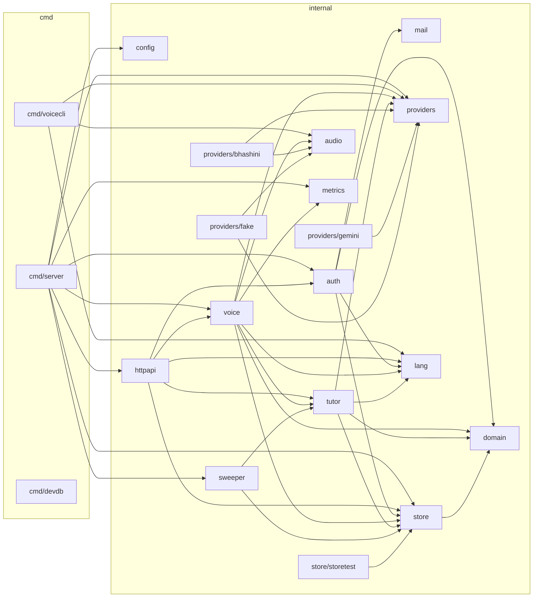

### 18.2 Data model (ER)

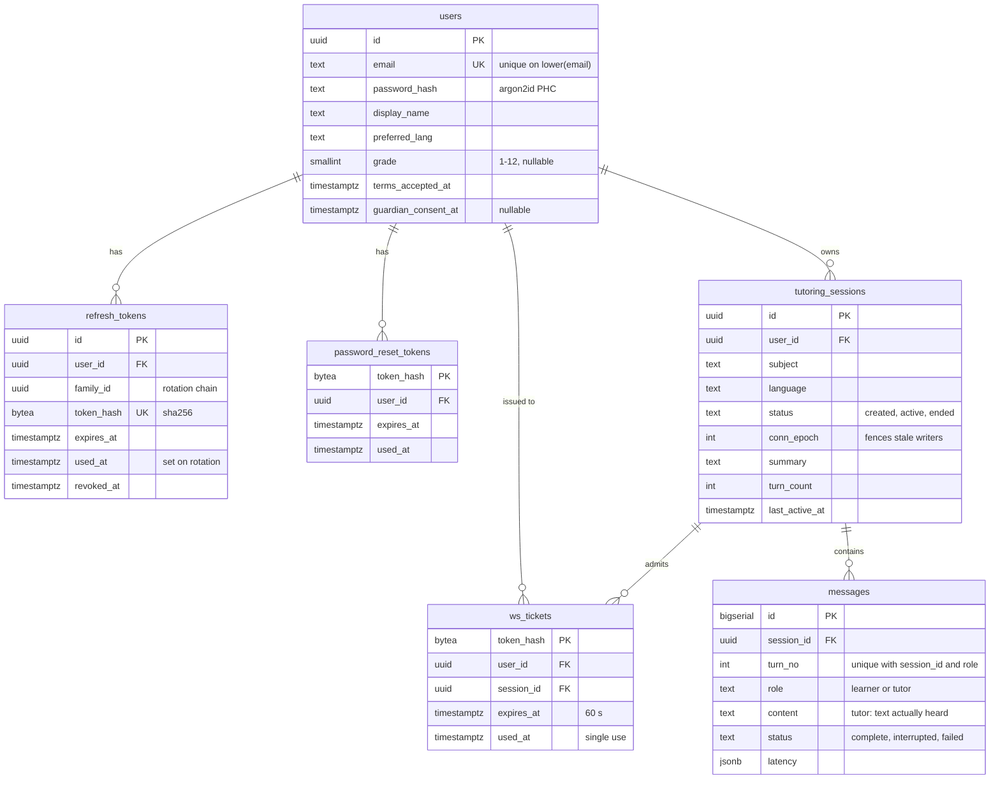

### 18.3 Class diagram: accounts

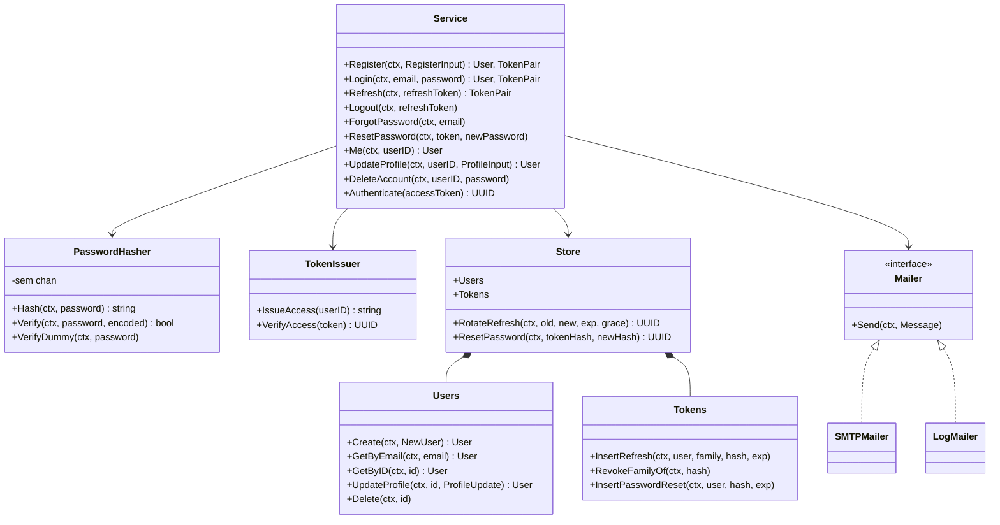

### 18.4 Class diagram: realtime core

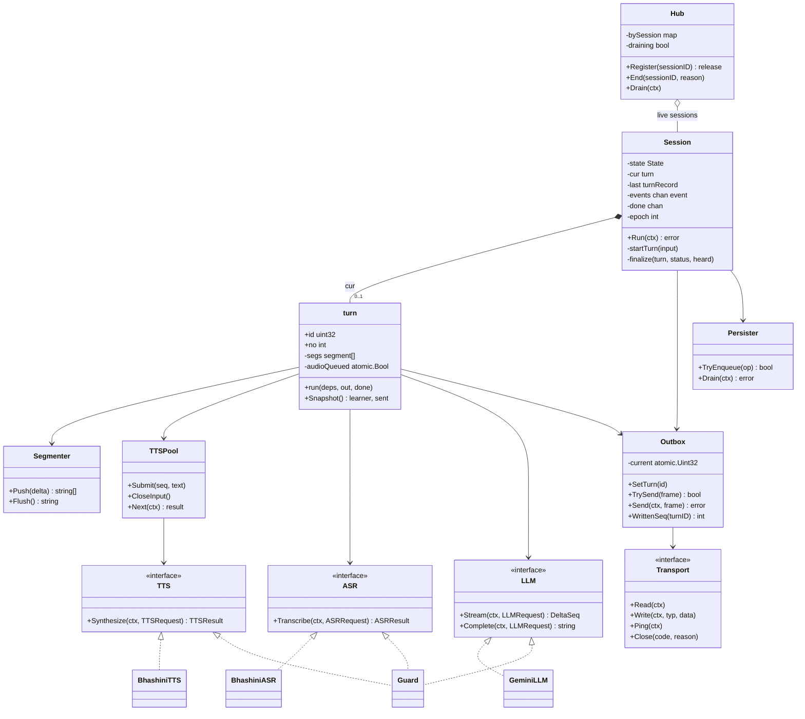

### 18.5 Session actor state machine

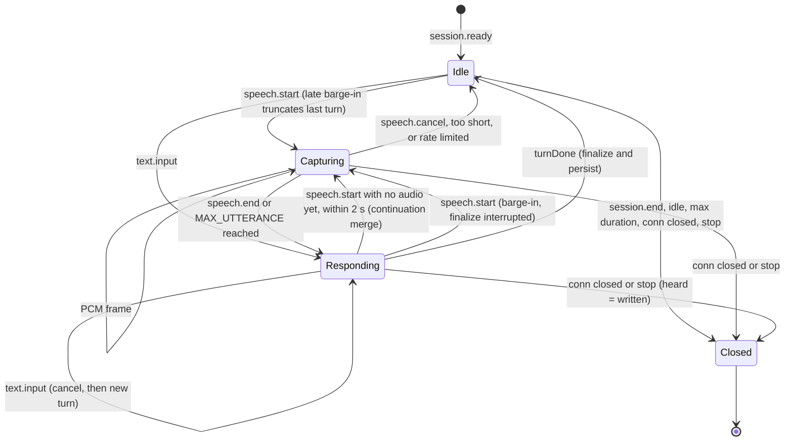

### 18.6 Sequence: refresh-token rotation

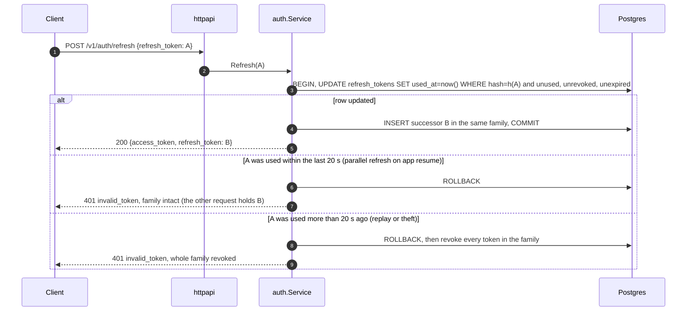

### 18.7 Sequence: WebSocket connect, resume, and replace

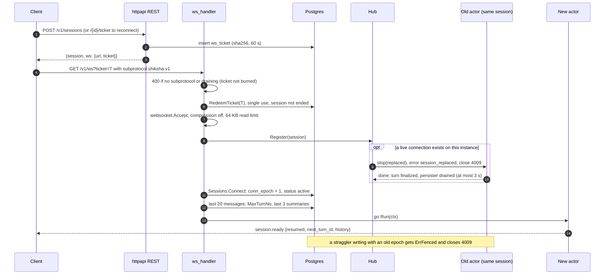

### 18.8 Sequence: voice turn (happy path)

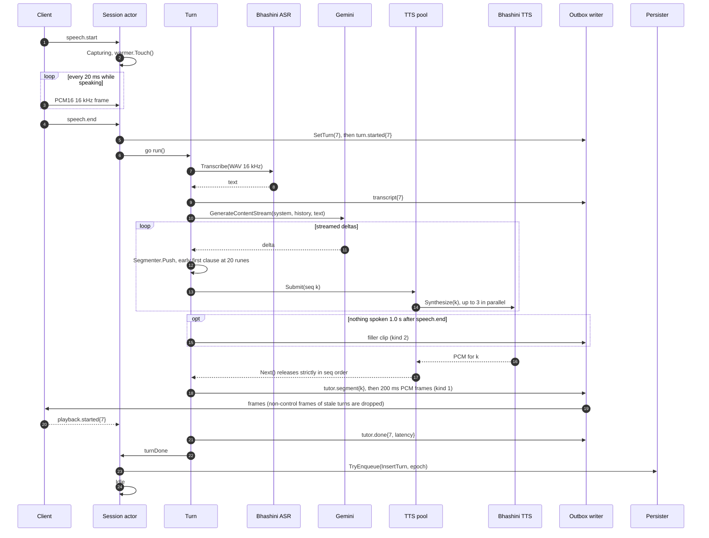

### 18.9 Sequence: barge-in (live and late) and continuation merge

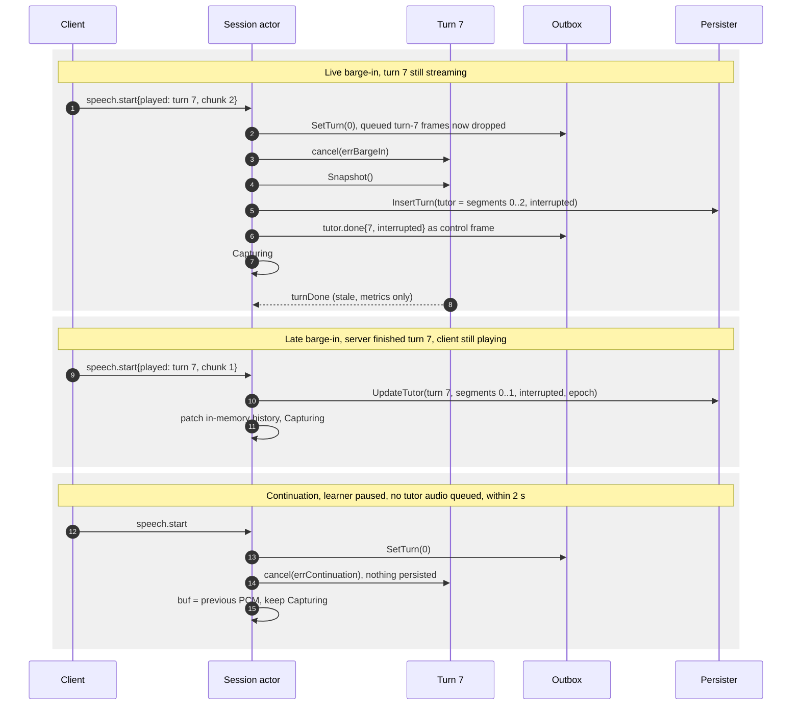

### 18.10 Latency timeline (p50 budget after speech.end)

```mermaid
gantt
    title Voice turn p50 budget (seconds.millis after speech.end)
    dateFormat x
    axisFormat %S.%L
    section Server pipeline
    Bhashini ASR (REST)         :asr, 0, 450
    Gemini time to first token  :ttft, 450, 800
    Tokens to first clause      :clause, 800, 950
    TTS first clause            :tts, 950, 1300
    First PCM frame written     :out, 1300, 1330
    section Masking
    Filler clip if still silent :filler, 1000, 1400
```

---

## 19. Revision 2: Clean Architecture and horizontal scaling

**Decisions (user, 2026-09-24):**
- Classic Clean Architecture layers.
- Postgres-only scaling behind ports.
- One binary with role flags.

This section is the authority on architecture and scaling. The earlier sections still hold for behaviour: protocol, state machine, pipeline, schema, API.

### 19.1 Layers and the dependency rule

| Layer | Package | May import | Holds |
|---|---|---|---|
| 1. Entities | `internal/entity` | stdlib, `uuid` | Enterprise rules: User, Email value object, password/name/grade rules, Language registry, RefreshToken replay rule, TutoringSession transitions, Message |
| 2. Use cases | `internal/usecase/...` | entity | Interactors (application rules) and the **ports** (interfaces) they need |
| 3. Interface adapters | `internal/adapter/...` | usecase, entity, infrastructure | Controllers (HTTP, WS), repositories (SQL), gateways (Bhashini, Gemini), event bus, job workers |
| 4. Frameworks & drivers | `internal/infrastructure/...` | usecase (to implement ports), entity | DB pool/tx/migrations, crypto, mail, rate limiter, queue, audio, clips, metrics, config |
| Composition root | `internal/bootstrap`, `cmd/shiksha` | everything | Wiring only |

**Rules:**
1. **Source dependencies point inward only.** `entity` and `usecase` never import `adapter`, `infrastructure` or `bootstrap`. `internal/archtest` enforces this by parsing imports, so a violation fails `go test`.
2. **Ports live where they are needed.** `usecase/ports.go` declares them; outer layers implement them. Controllers call use cases, never repositories.
3. **Transactions without SQL in the core.** A use case calls `TxManager.WithinTx(ctx, fn)`. The database layer carries the `pgx.Tx` in `ctx`, and repositories pick it up with `database.Conn(ctx, pool)`. Multi-repository operations such as a password reset stay atomic while use cases stay SQL-free.
4. **Time is injected** (`Now func() time.Time`). Time-based rules (refresh reuse grace, expiries) are unit-testable, and repositories store the timestamps they are given.
5. **Tests follow the layers.** Entities have pure unit tests. Use cases are tested against in-memory fakes of their ports, with no DB. Adapters are tested against real Postgres (embedded).
6. **Pragmatic Go.** Entities may cross the use-case boundary; there are no mirror DTOs inside the core. Request/response DTOs exist only in `adapter/httpapi`, and later in `adapter/ws`.

**Where the §9–§13 components live now:**
- **Session actor, turn pipeline, segmenter, TTS pool, persister, timing, hub** go in `usecase/conversation`, because they are application logic.
- **Frame codec, outbox with the drop rule, conn pumps** go in `adapter/ws`.
- **Bhashini, Gemini and fake providers, plus the Guard** go in `adapter/gateway`.
- **Prompt, history and summaries** go in `usecase`.
- **Sweeper** is replaced by periodic River jobs in `adapter/jobs`.

### 19.2 Dependency diagram (supersedes §18.1)

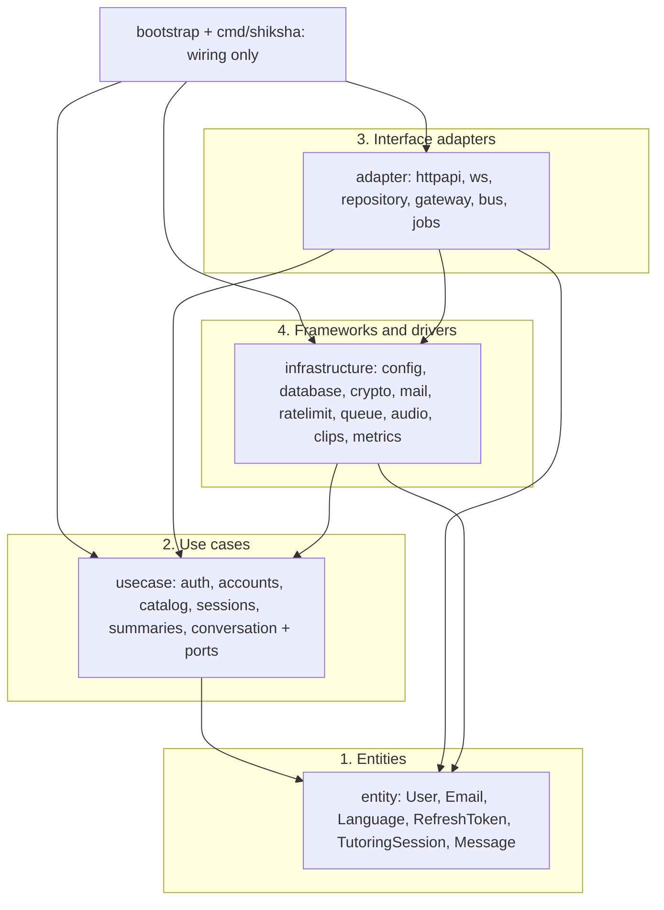

### 19.3 Ports catalogue

| Port | Declared in | Implemented by | Plan |
|---|---|---|---|
| `UserRepository`, `TokenRepository` | usecase | adapter/repository (Postgres) | 1 |
| `TxManager` | usecase | infrastructure/database | 1 |
| `PasswordHasher`, `AccessTokens`, `OpaqueTokens` | usecase | infrastructure/crypto | 1 |
| `Mailer` | usecase | infrastructure/mail (SMTP, log) | 1 |
| `RateLimiter` | adapter/httpapi (consumer side) | infrastructure/ratelimit (memory now, Redis later) | 1 |
| `SessionRepository`, `MessageRepository`, `TicketRepository` | usecase | adapter/repository | 3 |
| `JobQueue` (enqueue inside the caller's tx) | usecase | infrastructure/queue (River) | 3 |
| `EventBus` (session control: end / replace) | usecase | adapter/bus (LISTEN/NOTIFY) | 3 |
| `ASR`, `LLM`, `TTS` | usecase/conversation | adapter/gateway/{bhashini, gemini, fake} | 2 / 4 |
| `Output` (turn-tagged events) | usecase/conversation | adapter/ws (outbox + frame codec) | 4 |
| `Clips` | usecase/conversation | infrastructure/clips | 4 |

### 19.4 Runtime roles (one binary)

- `shiksha serve --roles=api,realtime,worker` starts the listed roles. The default is every role this build knows, so local dev runs everything in one process.
- `shiksha migrate` applies migrations and exits; run it as a release step in production.
- `serve --migrate` (the default in dev) migrates on start. The goose advisory lock makes concurrent starts safe.

| Role | Serves | State | Scale on |
|---|---|---|---|
| `api` | REST `/v1/*` | Stateless (JWT verified locally, no DB hit) | Request rate, CPU (argon2id) |
| `realtime` | WS `/v1/ws` | Per-connection actors; any instance can host any session, and sessions resume from the DB | Concurrent sessions |
| `worker` | River jobs: `summarize_session`, `send_email`, `sweep_stale_sessions` (periodic), `purge_expired` (periodic) | Stateless | Queue depth |

Every role also runs the admin listener (`/healthz`, `/readyz`, `/metrics`) and drains gracefully on SIGTERM.

### 19.5 Cross-instance coordination on Postgres (no Redis)

- **Session-control bus.** Messages look like `NOTIFY session_control, '{"session_id":"…","action":"end|replace","epoch":N}'`.
  - Each realtime instance holds one dedicated LISTEN connection and forwards events to its local hub for the sessions it hosts. That connection is direct, not through a transaction-pooling PgBouncer.
  - `replace`: the new connection bumps `conn_epoch` and publishes; the old instance closes with 4009.
  - `end`: REST `/end` publishes from any api instance.
- **Missed notifications are harmless.** A listener may miss events while reconnecting. The `conn_epoch` fence rejects straggler writes (§6), the sweeper job ends idle sessions, and after reconnecting the hub re-reads the status of every session it hosts.
- **Jobs (River on Postgres), transactional outbox.** A job is enqueued **in the same transaction** as the write that triggers it. For example, the password-reset token and its `send_email` job commit together. Periodic jobs use River's periodic and unique jobs, so exactly one instance runs each cluster-wide. This replaces the §13 sweeper goroutine.
- **Rate limiting.** The `RateLimiter` port has an in-memory adapter per instance, so the effective limit is limit × instances. That still bounds brute force at MVP scale. The upgrade is a Redis adapter with no core changes.
- **Provider concurrency.** Guard semaphores are per instance. Set `PROVIDER_MAX_CONCURRENCY` to roughly the provider quota divided by the number of realtime instances.
- **Caches** (Bhashini service config) are per instance and cheap to refetch.

### 19.6 Data tier

- **Connections:** one pgxpool per instance (`pool_max_conns` in `DATABASE_URL`), with the total kept under Postgres `max_connections`. api and worker pools can go through PgBouncer in transaction mode. The realtime LISTEN connection and River's notifier stay on direct connections.
- **Indexes and pagination:** every hot query is indexed (§6), and pagination is keyset only, never OFFSET.
- **Growth:** `messages` grows fastest. Partition it monthly on `created_at` once it passes about 50M rows.
- **Read replicas** can serve session-history reads later. Writes, tickets, epochs and jobs stay on the primary.

### 19.7 Capacity sketch (validated with `voicecli bench` in Plan 5)

- **realtime** is I/O-bound. Worst case per session is about 1.5 MB: the utterance buffer (≤ 960 KB at the 30 s cap) plus in-flight TTS PCM (about 3 × 130 KB). That leaves room for about 1,000 concurrent sessions on a 2 GB instance. CPU goes mostly to base64 and JSON.
- **The real ceiling is provider quotas** (Bhashini, Gemini RPM/TPM), which the Guard enforces and `/metrics` shows.
- **api** CPU is dominated by argon2id, capped at 2×NumCPU concurrent hashes (about 19 MiB each).

### 19.8 Deployment topology

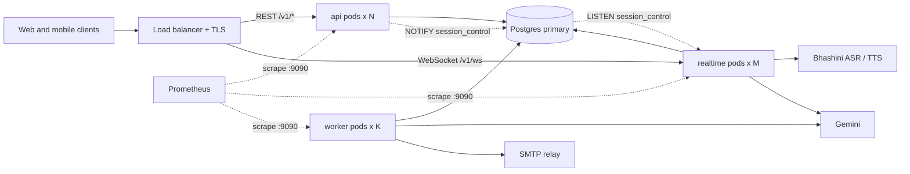

### 19.9 Phase changes

- **Plan 1** uses the Clean layout, `TxManager`, `usecase` interactors tested on fakes, the architecture test, `shiksha serve|migrate` with the `api` role, and the in-memory rate limiter behind a port.
- **Plan 3** adds River (the `worker` role) and the LISTEN/NOTIFY bus. It moves the password-reset email to a `send_email` job enqueued in the reset transaction, and replaces the sweeper goroutine with periodic jobs.
- **Plan 4** adds the `realtime` role, which subscribes to the bus.
